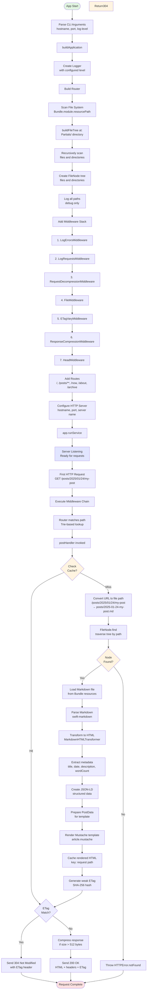

# Application Flow

```mermaid
flowchart TD
    Start([App Start]) --> CLI[Parse CLI Arguments<br/>hostname, port, log-level]
    CLI --> BuildApp[buildApplication]
    
    BuildApp --> Logger[Create Logger<br/>with configured level]
    Logger --> BuildRouter[Build Router]
    
    BuildRouter --> ScanFS[Scan File System<br/>Bundle.module.resourcePath]
    ScanFS --> BuildTree[buildFileTree at:<br/>Partials/ directory]
    BuildTree --> RecursiveScan[Recursively scan<br/>files and directories]
    RecursiveScan --> CreateNodes[Create FileNode tree<br/>files and directories]
    CreateNodes --> LogTree[Log all paths<br/>debug only]
    
    LogTree --> AddMiddleware[Add Middleware Stack]
    AddMiddleware --> MW1[1. LogErrorsMiddleware]
    MW1 --> MW2[2. LogRequestsMiddleware]
    MW2 --> MW3[3. RequestDecompressionMiddleware]
    MW3 --> MW4[4. FileMiddleware]
    MW4 --> MW5[5. ETagVaryMiddleware]
    MW5 --> MW6[6. ResponseCompressionMiddleware]
    MW6 --> MW7[7. HeadMiddleware]
    
    MW7 --> AddRoutes[Add Routes<br/>/, /posts/**, /now, /about, /archive]
    AddRoutes --> ConfigServer[Configure HTTP Server<br/>hostname, port, server name]
    ConfigServer --> RunService[app.runService]
    RunService --> Listening[Server Listening<br/>Ready for requests]
    
    Listening --> FirstRequest[First HTTP Request<br/>GET /posts/2025/01/24/my-post]
    
    FirstRequest --> MWChain[Execute Middleware Chain]
    MWChain --> Router[Router matches path<br/>Trie-based lookup]
    Router --> Handler[postHandler invoked]
    
    Handler --> CheckCache{Check<br/>Cache?}
    CheckCache -->|Hit| ETagMatch{ETag<br/>Match?}
    CheckCache -->|Miss| ConvertPath[Convert URL to file path<br/>/posts/2025/01/24/my-post<br/>→ posts/2025-01-24-my-post.md]
    
    ConvertPath --> FindNode[FileNode.find<br/>traverse tree by path]
    FindNode --> NodeFound{Node<br/>Found?}
    NodeFound -->|No| Return404[Throw HTTPError.notFound]
    NodeFound -->|Yes| LoadMD[Load Markdown file<br/>from Bundle resources]
    
    LoadMD --> ParseMD[Parse Markdown<br/>swift-markdown]
    ParseMD --> Transform[Transform to HTML<br/>MarkdownHTMLTransformer]
    Transform --> ExtractMeta[Extract metadata<br/>title, date, description, wordCount]
    
    ExtractMeta --> CreateLD[Create JSON-LD<br/>structured data]
    CreateLD --> PrepareData[Prepare PostData<br/>for template]
    PrepareData --> RenderTemplate[Render Mustache template<br/>article.mustache]
    
    RenderTemplate --> CacheHTML[Cache rendered HTML<br/>key: request path]
    CacheHTML --> GenerateETag[Generate weak ETag<br/>SHA-256 hash]
    GenerateETag --> ETagMatch
    
    ETagMatch -->|Yes| Send304[Send 304 Not Modified<br/>with ETag header]
    ETagMatch -->|No| Compress[Compress response<br/>if size > 512 bytes]
    Compress --> Send200[Send 200 OK<br/>HTML + headers + ETag]
    
    Send304 --> Done([Request Complete])
    Send200 --> Done
    Return404 --> Done
    
    style Start fill:#e1f5e1
    style Done fill:#ffe1e1
    style CheckCache fill:#fff4e1
    style NodeFound fill:#fff4e1
    style Return304 fill:#fff4e1
    style Listening fill:#e1e5ff
```
